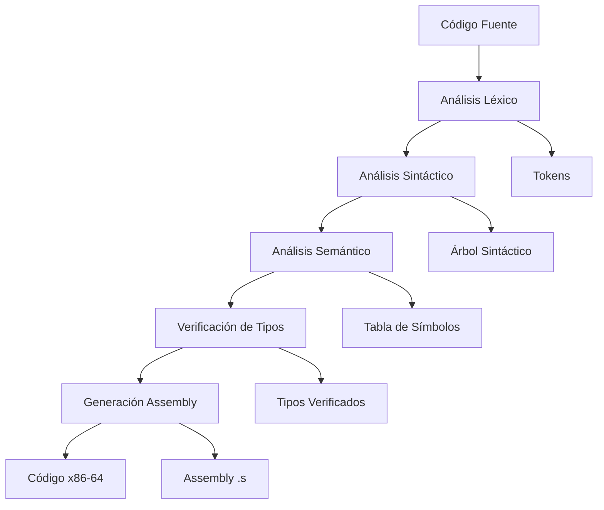

# 🔧 Compilador Completo con Generación de Assembly

> **Sistema de compilación educativo completo** que implementa un pipeline desde código fuente hasta assembly x86-64 ejecutable, incluyendo análisis léxico, sintáctico, semántico, verificación de tipos y generación de código.

## 📋 Tabla de Contenidos

- [Características](#-características)
- [Arquitectura](#-arquitectura)
- [Instalación](#-instalación)
- [Uso Rápido](#-uso-rápido)
- [Lenguaje Soportado](#-lenguaje-soportado)
- [Ejemplos](#-ejemplos)
- [Pipeline de Compilación](#-pipeline-de-compilación)
- [Herramientas](#-herramientas)
- [Estructura del Proyecto](#-estructura-del-proyecto)
- [Documentación](#-documentación)
- [Contribuir](#-contribuir)

## ✨ Características

### 🎯 **Pipeline Completo de Compilación**
- ✅ **Análisis Léxico** - Tokenización con detección de errores
- ✅ **Análisis Sintáctico** - Parser LL(1) con generación de AST
- ✅ **Análisis Semántico** - Tabla de símbolos y verificación de declaraciones
- ✅ **Verificación de Tipos** - Sistema robusto de inferencia y compatibilidad
- ✅ **Generación de Assembly** - Código x86-64 funcional

### 🛠️ **Herramientas de Desarrollo**
- 📊 **Compilación masiva** de múltiples archivos
- 🧪 **Suite de tests** automatizados
- 📈 **Reportes detallados** con estadísticas
- 🔧 **Interface unificada** con opciones avanzadas
- 📚 **Documentación automática** de ejemplos

### 🔍 **Detección Inteligente de Errores**
- Errores léxicos con línea y columna
- Errores sintácticos con mensajes descriptivos
- Errores semánticos (variables no declaradas, redeclaraciones)
- Errores de tipos con sugerencias de corrección

## 🏗️ Arquitectura



## 🚀 Instalación

### Prerrequisitos

- **Python 3.7+**
- **Git**
- **GCC** (opcional, para compilar assembly)

### Clonar Repositorio

```bash
git clone https://github.com/tu-usuario/compilador-completo.git
cd compilador-completo
```

### Instalar Dependencias

```bash
pip install -r requirements.txt
```

### Dependencias Opcionales

```bash
# Para compilar assembly generado (Linux/WSL)
sudo apt update
sudo apt install gcc build-essential

# Para visualizar grafos (opcional)
sudo apt install graphviz
```

## ⚡ Uso Rápido

### Compilación Básica

```bash
# Compilar archivo específico
python compilador_completo.py --file tipos-validos.txt

# Usar compilador directo
cd compilador
python sintactico.py
```

### Compilación Masiva

```bash
# Compilar todos los ejemplos
python compilador_completo.py --compile-all

# Usando utilidades
python utilidades.py --compile-all
```

### Generar y Compilar Assembly

```bash
# Crear Makefile
python compilador_completo.py --makefile

# Compilar assembly a ejecutable
make compile FILE=tipos-validos.s

# Compilar y ejecutar
make run FILE=tipos-validos.s
```

## 📝 Lenguaje Soportado

### Características del Lenguaje

- **Tipos de datos**: `int`, `float`, `text`, `bool`
- **Funciones**: Definición con parámetros y valores de retorno
- **Variables**: Declaración con inicialización
- **Operadores**: Aritméticos (`+`, `-`, `*`, `/`), relacionales (`<`, `>`, `==`), lógicos (`&&`, `||`)
- **Estructuras de control**: `if-else`, `while` (en desarrollo)

### Gramática

```bnf
programa ::= funcion programa | main
funcion ::= 'fn' ID '(' parametros ')' tipo '{' instrucciones '}'
main ::= 'fn' 'main' '(' ')' 'int' '{' instrucciones '}'
instrucciones ::= instruccion ';' instrucciones | ε
instruccion ::= asignacion | return
asignacion ::= ID tipo '=' expresion
expresion ::= termino ('+' | '-') expresion | termino
termino ::= factor ('*' | '/') termino | factor
factor ::= ID | NUMERO | '(' expresion ')'
```

## 🧪 Ejemplos

### Programa Simple

```c
fn main() int {
    x int = 10;
    y int = 20;
    z int = x + y;
    return 0;
}
```

### Función con Parámetros

```c
fn sumar(a int, b int) int {
    return a + b;
}

fn main() int {
    resultado int = sumar(5, 3);
    return 0;
}
```

### Operaciones con Tipos Mixtos

```c
fn main() int {
    x int = 5;
    y float = 3.14;
    z float = x + y;  // Conversión automática int -> float
    return 0;
}
```

## 🔄 Pipeline de Compilación

### 1. Análisis Léxico
```
Entrada: fn main() int { x int = 5; }
Salida:  [fn, main, (, ), int, {, x, int, =, 5, ;, }]
```

### 2. Análisis Sintáctico
```
Genera árbol sintáctico usando tabla LL(1)
Detecta errores de estructura
```

### 3. Análisis Semántico
```
Construye tabla de símbolos
Verifica declaraciones de variables
Detecta redeclaraciones
```

### 4. Verificación de Tipos
```
Infiere tipos de expresiones
Verifica compatibilidad en asignaciones
Detecta operaciones inválidas
```

### 5. Generación de Assembly
```assembly
.section .data
    # Variables globales

.section .text
    .global _start

main:
    push %rbp
    mov %rsp, %rbp
    # Código generado
    mov $0, %eax
    pop %rbp
    ret
```

## 🛠️ Herramientas

### Compilador Principal

```bash
# Interface unificada
python compilador_completo.py [opciones]

# Opciones disponibles:
--file ARCHIVO       # Compilar archivo específico
--compile-all        # Compilar todos los ejemplos
--no-assembly        # Solo análisis, sin generar assembly
--quiet              # Modo silencioso
--makefile           # Crear Makefile
```

### Utilidades de Desarrollo

```bash
python utilidades.py [opciones]

# Opciones disponibles:
--test               # Ejecutar suite de tests
--verify             # Verificar estructura del proyecto
--clean              # Limpiar archivos temporales
--docs               # Generar documentación
--report             # Mostrar último reporte
```

### Compilador Directo

```bash
cd compilador
python sintactico.py  # Compila archivo configurado en lexico.py
```

## 📁 Estructura del Proyecto

```
compilador-completo/
├── 📁 compilador/              # Núcleo del compilador
│   ├── lexico.py              #   Analizador léxico
│   ├── sintactico.py          #   Analizador sintáctico + semántico + tipos
│   └── assembly.py            #   Generador de código assembly
├── 📁 codigos-bocetos/        # Archivos de código fuente de prueba
├── 📁 gramatica/              # Definición de la gramática
├── 📁 tabla-ll1/              # Tabla LL(1) generada
├── 📁 salida-tokens/          # Tokens generados por archivo
├── 📁 salida-arboles/         # Árboles sintácticos y tablas de símbolos
├── 📁 salida-assembly/        # Código assembly generado
├── 📁 ejecutables/            # Programas compilados
├── 📁 reportes/               # Reportes de compilación
├── 📁 docs/                   # Documentación generada
├── compilador_completo.py     # Interface principal unificada
├── utilidades.py              # Herramientas de desarrollo
├── README.md                  # Este archivo
├── requirements.txt           # Dependencias Python
└── Makefile                   # Para compilar assembly (generado)
```

## 📊 Salidas Generadas

| Directorio | Archivo | Descripción |
|------------|---------|-------------|
| `salida-tokens/` | `archivo-tokens.txt` | Lista de tokens reconocidos |
| `salida-arboles/` | `archivo.dot` | Árbol sintáctico (Graphviz) |
| `salida-arboles/` | `archivo-tabla-simbolos.csv` | Tabla de símbolos |
| `salida-assembly/` | `archivo.s` | Código assembly x86-64 |
| `ejecutables/` | `archivo` | Ejecutable compilado |
| `reportes/` | `reporte_*.json` | Estadísticas de compilación |

## 🧪 Testing

### Ejecutar Tests

```bash
# Suite completa de tests
python utilidades.py --test

# Verificar estructura
python utilidades.py --verify

# Compilar todos los ejemplos
python utilidades.py --compile-all
```

### Tests Incluidos

- ✅ **Importación de módulos**
- ✅ **Análisis léxico básico**
- ✅ **Validación de tabla LL(1)**
- ✅ **Compilación de programa simple**

## 📈 Estadísticas

El compilador genera estadísticas detalladas:

```
📊 RESUMEN DE COMPILACIÓN
════════════════════════════════════════
📁 Archivo procesado: tipos-validos.txt
🔤 Tokens procesados: 32
📝 Líneas de assembly generadas: 45
⏱️  Tiempo de compilación: 0.123s

🎯 RESULTADO FINAL: ✅ COMPILACIÓN EXITOSA
```

## 🎯 Casos de Uso

### Educativo
- **Enseñanza de compiladores** - Pipeline completo visible
- **Análisis de errores** - Detección robusta en cada fase
- **Generación de código** - Assembly legible y funcional

### Desarrollo
- **Prototipado de lenguajes** - Gramática modificable
- **Testing de compiladores** - Suite automática de pruebas
- **Investigación** - Análisis de tipos y optimizaciones

## 🔧 Personalización

### Modificar la Gramática

1. Editar `gramatica/gramatica.txt`
2. Regenerar tabla LL(1):
   ```bash
   cd generador-de-tablas-ll1
   python generador-ll1.py
   ```
3. Actualizar analizador sintáctico si es necesario

### Agregar Nuevos Tipos

1. Modificar `lexico.py` para reconocer nuevos tokens
2. Actualizar `sintactico.py` para manejar nuevos tipos
3. Extender `assembly.py` para generar código apropiado

### Extender el Generador de Assembly

```python
# En assembly.py
class GeneradorAssembly:
    def generar_nueva_instruccion(self, nodo, ambito):
        # Implementar nueva funcionalidad
        pass
```

## 🐛 Solución de Problemas

### Error de Emojis en Windows

```bash
# Cambiar codificación de PowerShell
[Console]::OutputEncoding = [Text.UTF8Encoding]::UTF8
```

### Error de Importación

```bash
# Verificar estructura de directorios
python utilidades.py --verify
```

### Assembly No Compila

```bash
# Verificar GCC instalado
gcc --version

# En Windows, usar WSL o MinGW
```

## 📚 Documentación Adicional

- **[Especificación Léxica](docs/especificacion-lexica.md)** - Tokens y reglas léxicas
- **[Gramática Completa](gramatica/gramatica.txt)** - Definición BNF
- **[Tabla LL(1)](tabla-ll1/tabla_ll1.csv)** - Tabla de análisis sintáctico
- **[Ejemplos de Código](docs/ejemplos.md)** - Casos de uso detallados

## 🤝 Contribuir

### Cómo Contribuir

1. **Fork** el repositorio
2. **Crear** rama para tu feature: `git checkout -b feature/nueva-caracteristica`
3. **Commit** tus cambios: `git commit -m 'Agregar nueva característica'`
4. **Push** a la rama: `git push origin feature/nueva-caracteristica`
5. **Abrir** Pull Request

### Áreas de Mejora

- 🔄 **Optimización de código assembly**
- 🔄 **Soporte para arrays y estructuras**
- 🔄 **Más estructuras de control** (`for`, `switch`)
- 🔄 **Funciones con parámetros por referencia**
- 🔄 **Generación de código intermedio**
- 🔄 **Soporte para más arquitecturas**

## 📄 Licencia

Este proyecto está bajo la Licencia MIT. Ver el archivo [LICENSE](LICENSE) para más detalles.

## 👨‍💻 Autor

https://github.com/JersonCh1/20-06COMPILADORES.git

## 🙏 Agradecimientos

- Inspirado en principios de diseño de compiladores clásicos
- Utiliza herramientas estándar de la industria (Python, GCC, Graphviz)
- Agradecimiento especial a la comunidad de desarrollo de compiladores

## 📊 Estado del Proyecto

- ✅ **Análisis Léxico** - Completo y funcional
- ✅ **Análisis Sintáctico** - LL(1) implementado
- ✅ **Análisis Semántico** - Tabla de símbolos funcional
- ✅ **Verificación de Tipos** - Sistema robusto implementado
- ✅ **Generación Assembly** - x86-64 funcional
- 🔄 **Optimizaciones** - En desarrollo
- 🔄 **Más arquitecturas** - Planificado

